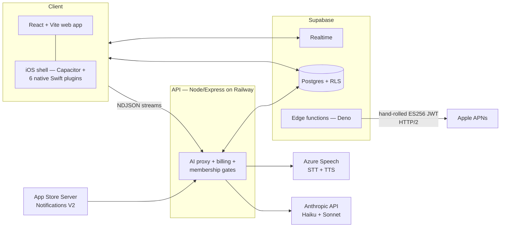

# Yelo — system architecture

**[Yelo](https://yelofamily.com)** is an AI voice companion for elderly,
limited-English-speaking parents — live on the
[App Store](https://apps.apple.com/us/app/yelo-family/id6766414810). One
person builds and operates it end to end. This page is the engineering
write-up: the mechanisms, and why they're shaped the way they are.

*No product code here — the repo is private (it serves real families). This
is the systems story. Two pieces were extracted as standalone open source:
[apns-es256](https://github.com/Alecchoy/apns-es256) and
[tts-sentence-splitter](https://github.com/Alecchoy/tts-sentence-splitter).*

## The shape of it

React 18 + Vite, plain CSS, no state library. The iOS app is a Capacitor
shell around the production web origin — web fixes ship to phones with no
app-store release — plus ~7,900 lines of native Swift across six plugins
(speech recognition, an AVAudioSession state machine, push-to-talk with a
Live Activity, StoreKit 2, and more). Express is the AI proxy and billing
brain; Supabase owns data, auth, realtime, and edge functions.

## Voice that answers before the model finishes

The pipeline that matters most: an elderly user asks a question by voice and
should not stare at a silent screen.

1. Speech streams to **Azure STT over a WebSocket** (the client mints a
   short-lived token from the API; audio never proxies through my server).
2. The reply model streams tokens back over **NDJSON**.
3. A locale-aware splitter finds **sentence boundaries across scripts** —
   `。` `।` `។` all count, `3.14` doesn't — and each completed sentence goes
   to Azure TTS *immediately*, with per-sentence **viseme timings** driving
   the character's lip-sync.
4. A producer/consumer queue keeps synthesis one sentence behind generation,
   so Yelo starts speaking while the model is still thinking.
5. **Speculative streaming**: generation actually starts *before* the intent
   checks settle; if a check changes the prompt, the stream aborts and
   restarts. The common case gets the head start; the rare case pays one
   restart.

## Multi-tenant security for families

The threat model is unusual: the users are elderly and the data is a
family's private life. Supabase's anon key is public by design, so **a valid
JWT proves identity, not authorization**. Three layers enforce isolation:

- **Postgres row-level security on every table**, scoped through a
  tenant-resolution helper — every query is filtered to the caller's family
  in the database itself, not in application code.
- **Column-level write guards**: billing and privilege fields are read-only
  for clients at the trigger level. Even a compromised session can't
  self-upgrade a subscription or promote a member.
- **A server-side membership gate on every AI endpoint** — dozens of routes
  re-verify family membership before doing anything, because "has a JWT" and
  "belongs to this family" are different claims.

Privacy follows the same posture: chat prompts instruct the model to never
repeat sensitive numbers back; the memory-extraction path runs PII redaction
on input *and* output; retention crons delete old conversation data on
schedule. Photos for document help exist only in transient request state —
there is no image storage anywhere in the system.

## Model routing as a cost architecture

Every AI call site is tiered by what it actually needs: **Haiku** on the
conversational hot path and every classifier, **Sonnet** only where
multi-step reasoning earns it (tutorial generation, page-reasoning). Prompt
prefixes are cached (`cache_control: ephemeral`), and a per-family cost
meter tracks spend in **integer microdollars** — floats and money don't mix —
feeding budget tiers that degrade gracefully instead of cutting a family off
mid-conversation.

## Push and billing, without SDKs

- **APNs from scratch**: pushes send from a Deno edge function that signs
  ES256 JWTs with `crypto.subtle` and POSTs to Apple over HTTP/2 — no
  SDK. Published as [apns-es256](https://github.com/Alecchoy/apns-es256).
- **StoreKit 2 billing verified offline** against Apple's root certificates
  (vendored, public), hardened against replayed transactions and
  out-of-order App Store Server Notifications — webhook events fold into the
  database atomically with an event-timestamp guard, so a stale "cancelled"
  can never clobber a newer "renewed."

## Operating it

One person provisions and runs the whole stack: Railway (git-push deploys),
custom DNS, Supabase, Twilio Verify for phone auth, Azure Speech. CI enforces
**15-language localization** — the test suite fails if any UI string is
missing from any locale — plus test-count floors so a silently-skipped suite
can't pass. Hourly automated ops alerts on exceptions, AI errors, and
LLM-cost thresholds.

## Numbers that are real

- **15 languages** live (17 wired; 2 held for RTL polish)
- **~7,900 lines** of native Swift across 6 Capacitor plugins
- **4 months** from first commit to App Store approval
- **2 users who matter most** — my mom and dad, the QA team

— Alec Choy · [yelofamily.com](https://yelofamily.com) ·
[LinkedIn](https://www.linkedin.com/in/alec-choy-387aab13b/)
